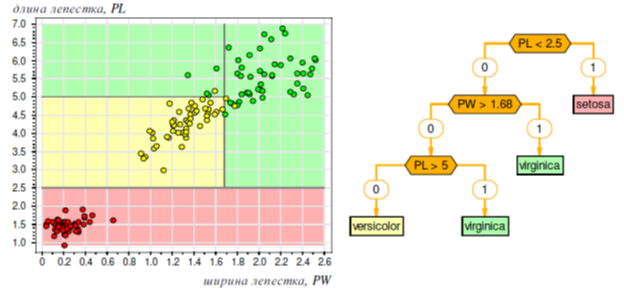
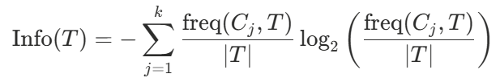
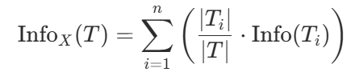

# Глава 7. Деревья решений

## 7.1 Алгоритм C4.5

На рисунке 27 изображена задача «ирисы Фишера», предполагающая классификацию на 3 класса, линейными классификаторами ее решить невозможно, нелинейные будут избыточны из-за малого количества признаков. Но с этой задачей справятся деревья решений (decision trees), которые последовательно применяют решающие правила (предикаты).

Рисунок 27. Задача «ирисы Фишера»

Дерево решений – способ представления правил в иерархической, последовательной структуре, где каждому объекту соответствует единственный узел, дающий решение. В результате формируется покрывающий набор конъюнкций.

Каждый узел дерева содержит признак, ребра – значения признака, листы – метки классов, пример такого дерева показан на рисунке 27 справа. Классы должны быть дискретными. Каждый пример должен однозначно относиться к одному из классов. Справа показаны решающие поверхности, порожденные деревом решений.

C4.5 [45] – алгоритм построения дерева решений, количество потомков у узла не ограничено. Решает только задачи классификации. В нем есть важное требование: количество классов должно быть значительно меньше количества записей в исследуемом наборе данных.

Пусть  – множество примеров, где каждый элемент описывается  атрибутами,  - метка класса

Процесс построения дерева будет происходить итеративно сверху вниз.

На первом шаге мы имеем пустое дерево (имеется только корень) и исходное множество  (ассоциированное с корнем). Требуется разбить исходное множество на подмножества. Делается через выбор одного из атрибутов в качестве проверки.

Тогда в результате разбиения получаются  (по числу значений атрибута) подмножеств и, соответственно, создаются  потомков корня, каждому из которых поставлено в соответствие свое подмножество, полученное при разбиении множества .

В процессе построения любого дерева решений необходимо выбрать критерий разбиения (в случае C4.5 это прирост информации), правило остановки (при небольшой выборке дерево строят до ее исчерпания, при большой – применяют отсечение).

**Отсечение ветвей** (pruning) - эвристический метод. Идем от листов к корню, помечая по некоторому критерию, например качество классификации, узлы на удаление. Вместо узлов ставится лист с меткой класса с наибольшим количеством исходов в этом поддереве.

**Критерий разбиения**

Пусть мы имеем проверку  (в качестве проверки может быть выбран любой атрибут), которая принимает  значений . Тогда разбиение  по проверке  даст нам подмножества , при  равном соответственно .  – количество примеров из множества , относящихся к классу .

Оценка среднего количества информации, необходимого для определения класса примера из множества  (энтропия):

Оценка среднего количества информации, необходимого для определения класса примера из множества  после разбиения множества  по  (условная энтропия):

Оценка потенциальной информации, получаемой при разбиении множества  на  подмножеств. Необходим для учета атрибутов с уникальными значениями.

Нормированный прирост информации

Критерий  считается для всех атрибутов. Выбирается атрибут с максимальным . Этот атрибут будет являться проверкой в текущем узле дерева, а затем по этому атрибуту производится дальнейшее построение дерева.

Такие же рассуждения можно применить к полученным подмножествам  и продолжить рекурсивно процесс построения дерева, до тех пор, пока в узле не окажутся примеры из одного класса.

Для примера возьмем таблицу 4.

Таблица 4. Пример данных для построения дерева решений

| № | Признаки |  |  |  | Класс |
| --- | --- | --- | --- | --- | --- |
|  | Outlook | Temperature | Humidity | Windy |  |
| 1 | Sunny | Hot | High | False | N |
| 2 | Sunny | Hot | High | True | N |
| 3 | Overcast | Hot | High | False | P |
| 4 | Rain | Mild | High | False | P |
| 5 | Rain | Cool | Normal | False | P |
| 6 | Rain | Cool | Normal | True | N |
| 7 | Overcast | Cool | Normal | True | P |
| 8 | Sunny | Mild | High | False | N |
| 9 | Sunny | Cool | Normal | False | P |
| 10 | Rain | Mild | Normal | False | P |
| 11 | Sunny | Mild | Normal | True | P |
| 12 | Overcast | Mild | High | True | P |
| 13 | Overcast | Hot | Normal | False | P |
| 14 | Rain | Mild | High | True | N |

Посчитаем критерий разбиения для всех признаков, чтобы определить какой признак будет помещен в корень дерева. В начале у нас полный набор данных, поэтому энтропия:

Для признака Outlook имеем 3 значения, каждое из которых дает свое подмножество :

$$
\begin{align*}
\text{Info}_X(T) = &\left(\frac{5}{14}\left(-\frac{3}{5}\log_2\left(\frac{3}{5}\right) + \frac{2}{5}\log_2\left(\frac{2}{5}\right)\right)\right) \\
&+ \left(\frac{4}{14}\left(-\frac{4}{4}\log_2\left(\frac{4}{4}\right) + \frac{0}{4}\log_2\left(\frac{0}{4}\right)\right)\right) \\
&+ \left(\frac{5}{14}\left(-\frac{3}{5}\log_2\left(\frac{3}{5}\right) + \frac{2}{5}\log_2\left(\frac{2}{5}\right)\right)\right)
\end{align*}
$$

Точно также считается для оставшихся признаков. Затем выбираем признак с максимальным нормированным приростов информации и помещаем его в корень. Следующим шагом заполняем узлы по значениям признака в корне, но в этот раз множество  будет состоять не из 14 строк, а из такого количества строк, где признак в корне принял то или иное значение.